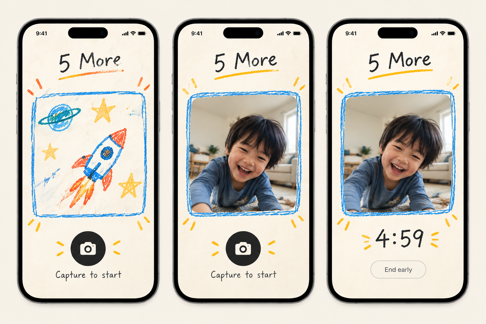
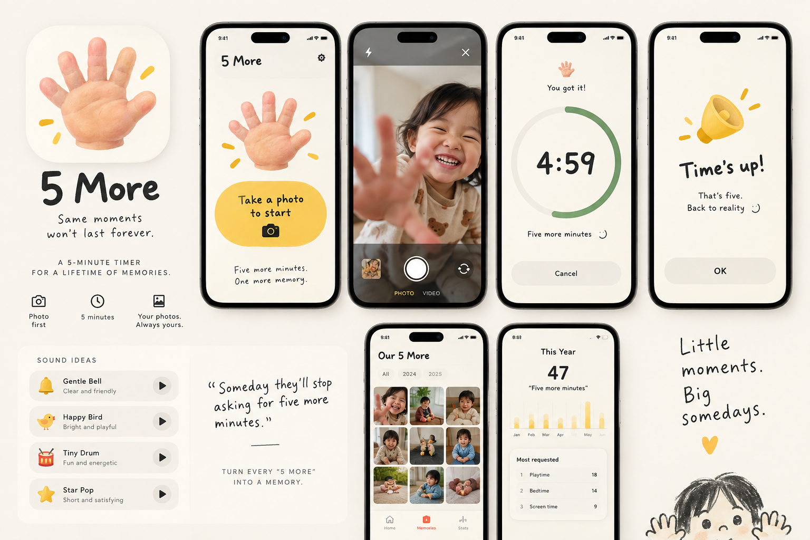

# 5 More — Product Requirements Document

> 이 문서는 5 More의 제품 원칙, 구현 범위, 출시 로드맵과 완료 체크리스트를 한곳에서 관리하는 기준 문서다.
> 기능이나 범위를 변경할 때는 코드보다 이 문서를 먼저 갱신한다.

| 항목 | 내용 |
| --- | --- |
| 상태 | Draft v0.4 |
| 플랫폼 | iPhone / iOS 17+ |
| 구현 방식 | SwiftUI 네이티브 |
| 수익 모델 | 30회 무료 사용 후 1회성 영구 잠금 해제, Family Sharing 포함 |
| 데이터 원칙 | 로컬 우선, 계정·백엔드·클라우드 사진 저장 없음 |
| 핵심 흐름 레퍼런스 | [`docs/assets/5more-core-flow-reference.png`](docs/assets/5more-core-flow-reference.png) |
| 브랜드 시스템 레퍼런스 | [`docs/assets/5more-brand-system-reference.png`](docs/assets/5more-brand-system-reference.png) |





---

## 1. 제품 요약

### 한 문장

아이가 “5분만 더!”라고 말하는 순간, 부모가 사진 한 장을 찍어 5분 타이머를 시작하고 그 순간을 자연스럽게 추억으로 남기는 iPhone 앱.

### 문제

어린아이는 놀이를 멈추고 다음 활동으로 전환하는 일을 어려워한다. 부모에게 “5분만 더”는 반복되는 협상과 피로가 되지만, 동시에 곧 지나가 버릴 어린 시절의 한 장면이기도 하다.

기존 타이머는 종료와 통제에 집중하고, 카메라 앱은 기록에 집중한다. 5 More는 두 행동을 하나로 묶어 갈등의 순간을 작은 가족 기록으로 바꾼다.

### 제품 가설

부모가 별도 설정 없이 사진 한 장으로 타이머를 시작할 수 있다면:

- 아이에게는 남은 시간이 시각적으로 명확해진다.
- 부모는 전환을 반복해서 설명하는 부담을 줄일 수 있다.
- 평범하지만 소중한 몰입의 순간이 자연스럽게 사진으로 축적된다.

---

## 2. 목표와 비목표

### V1 목표

- 앱 실행 후 15초 안에 사진을 찍고 5분 타이머를 시작할 수 있다.
- Home → Camera → Timer가 동일한 프레임 안에서 상태 전환으로 느껴진다.
- 촬영한 사진은 사용자의 일반 사진 보관함에 저장된다.
- 앱은 사진 복사본 대신 로컬 사진 식별자와 최소 메타데이터만 보관한다.
- 이전 5 More 순간을 시간순으로 다시 볼 수 있다.
- 각 Moment에 선택적으로 5초 음성 Cheer를 붙여 완료 알림과 Memories에서 다시 들을 수 있다.
- 첫 30회는 결제 없이 전체 핵심 경험을 사용할 수 있다.
- 펼친 다섯 손가락으로 자동 촬영을 시작하고, 완료 후 같은 사진으로 한 번 더 이어갈 수 있다.
- 31번째 사용부터 1회성 결제로 무제한 사용을 잠금 해제할 수 있다.
- 계정이나 자체 서버 없이 실제 iPhone에서 안정적으로 동작한다.

### V1 비목표

- Android 및 iPad 전용 레이아웃
- 로그인, 프로필, 자녀별 관리
- 구독, 광고, 소모성 크레딧
- 소셜 기능, 앱 내부 공유 피드
- AI 기능
- 클라우드 동기화나 자체 사진 저장소
- 게임화, 랭킹, 배지
- 카테고리 입력, 사용 통계, 연간 리포트
- 긴 음성 메모, 고음질 음악 녹음, 클라우드 음성 백업
- 고급 사진 편집
- 강한 알람이나 지속적인 백그라운드 오디오

### V1 이후 검토 후보

아래 항목은 두 번째 레퍼런스가 보여 주는 확장 가능성이지만 V1 약속은 아니다. 핵심 흐름 검증 후 별도 요구사항과 수용 기준을 작성해야 범위에 넣을 수 있다.

- 연간 `Five more minutes` 횟수처럼 입력 없이 계산 가능한 가벼운 통계
- 시간대별 또는 월별 Memories 회고
- 마케팅용 회고 카드와 `Little moments. Big somedays.` 메시지

---

## 3. 대상 사용자와 핵심 상황

### 1차 사용자

- 약 2–8세 자녀를 둔 부모 또는 보호자
- 놀이, TV, 그림, 블록, 놀이터 등에서 활동 전환을 자주 협상하는 사람
- 복잡한 육아 앱보다 즉시 사용할 수 있는 작은 도구를 선호하는 사람

### 핵심 사용 상황

1. 아이가 현재 활동을 그만두기 싫어한다.
2. 부모와 아이가 “5분 더”에 합의한다.
3. 부모가 앱을 열고 현재 순간을 촬영한다.
4. 촬영 즉시 5분 카운트다운이 시작된다.
5. 시간이 끝나면 부드러운 완료 상태를 함께 확인한다.
6. 사진은 사진 보관함과 앱의 Memories에서 다시 볼 수 있다.

---

## 4. 제품 원칙

1. **Capture is the start.** 별도 시간 설정이나 시작 버튼을 만들지 않는다.
2. **One frame, three states.** 그림, 카메라, 촬영 사진이 동일한 프레임을 공유한다.
3. **Gentle, not disciplinary.** 아이를 통제하거나 재촉하는 언어와 알람 미학을 피한다.
4. **The photo belongs to the family.** 사진은 사용자의 Photos 보관함에 저장하고 서버로 보내지 않는다.
5. **Earn the purchase.** 결제 전에 실제 핵심 경험을 충분히 제공한다.
6. **No hostage data.** 결제하지 않아도 이미 만든 Memories를 계속 볼 수 있다.
7. **No scope creep.** V1의 가치는 사진 한 장과 5분 타이머의 결합에 있다.

---

## 5. 핵심 경험

### 5.1 전체 상태 흐름

```text
Launch
  ↓
Home: crayon illustration
  ↓ Take a photo to start
Camera: live preview in the same frame
  ↓ Shutter
Save photo + consume one free use if applicable
  ↓
Timer: captured photo + 5:00 countdown
  ├─ End early → Completion
  └─ 0:00 → Completion
  ↓
Home or Memories
```

무료 사용을 모두 소진한 경우:

```text
Home
  ↓ Take a photo to start
Paywall
  ├─ Purchase verified → Camera
  ├─ Restore verified → Camera
  └─ Dismiss/cancel → Home
```

### 5.2 Home

화면 요소:

- 손으로 쓴 느낌의 `5 More` 브랜드
- 종이 질감의 따뜻한 오프화이트 배경
- 파란 크레용 프레임
- 아이가 몰입하는 활동을 표현한 단순한 크레용 일러스트
- 원형 카메라 CTA
- `Take a photo to start`
- Memories 진입점
- 우측 상단 Settings 진입점
- 무료 상태일 때 방해되지 않는 크기의 `N free moments left`

동작:

- CTA를 누르면 카메라 권한을 필요한 시점에 요청한다.
- 권한이 있으면 일러스트 프레임이 같은 위치에서 라이브 카메라로 전환된다.
- 무료 횟수가 0이고 구매 권한이 없으면 카메라 대신 Paywall을 표시한다.

수용 기준:

- [ ] 앱 실행 후 핵심 CTA가 즉시 보인다.
- [ ] 사용자가 타이머의 목적을 별도 온보딩 없이 이해할 수 있다.
- [ ] 레이아웃 점프 없이 프레임의 내용만 전환된다.
- [ ] 무료 잔여 횟수가 정확하지만 시각적 중심이 되지 않는다.

### 5.3 Camera

화면 요소:

- Home과 동일한 브랜드, 프레임 크기, CTA 위치
- 프레임 내부의 라이브 카메라 프리뷰
- 원형 셔터 버튼
- `Take a photo to start`
- 취소/뒤로가기

동작:

- 완전히 다른 전체 화면 카메라 UI로 이동하지 않는다.
- 셔터 한 번으로 사진을 촬영하고 Photos에 저장한 뒤 타이머를 시작한다.
- 저장이 실패하면 무료 횟수를 차감하거나 타이머를 시작하지 않는다.
- 중복 탭으로 두 장이 저장되지 않도록 촬영 중 CTA를 잠근다.

수용 기준:

- [ ] 카메라 프리뷰가 파란 크레용 프레임 안을 채운다.
- [ ] 촬영부터 타이머 표시까지 체감 지연이 1초 이하다.
- [ ] 권한 거부, 카메라 불가, 저장 실패에 복구 가능한 안내가 나온다.
- [ ] 전면/후면 카메라 전환은 V1에서 제공하지 않는다. 기본은 후면 카메라다.

### 5.4 Timer

화면 요소:

- 카메라 프리뷰가 같은 프레임 안에서 촬영 사진으로 정지
- 프레임 아래 `5:00`에서 시작하는 카운트다운
- 작은 보조 동작 `End early`

동작:

- 촬영과 사진 저장이 성공한 시점을 5분의 시작으로 기록한다.
- 매초 숫자를 차감하는 값이 아니라 절대 종료 시각을 기준으로 남은 시간을 계산한다.
- 앱이 백그라운드에 갔다 돌아와도 실제 경과 시간을 반영한다.
- 타이머 진행 중 앱이 종료되어도 재실행 시 활성 타이머를 복구한다.
- 알림이 허용된 경우 백그라운드에서도 0:00에 부드러운 로컬 알림을 보낸다.
- `End early`도 하나의 사용으로 계산한다.

수용 기준:

- [ ] Home/Camera/Timer의 사진 프레임 위치와 크기가 동일하다.
- [ ] 백그라운드 복귀 후 남은 시간이 정확하다.
- [ ] 앱 재실행 시 활성 타이머와 촬영 사진이 복구된다.
- [ ] VoiceOver가 남은 시간을 의미 있게 읽는다.

### 5.4.1 손가락으로 시간 정하기

카메라 화면에서 Vision의 손 인식으로 **펼친 손바닥 다섯 손가락**을 확인하면 자동으로 촬영한다. 손은 시간 입력 장치가 아니라, 아이와 부모가 함께 이해하는 “5 More”의 시작 제스처다. 타이머는 항상 5분이다.

동작:

- 손이 인식되면 안정화 후 자동으로 촬영한다. 부모가 셔터를 누를 필요가 없다.
- 안정화 전에 셔터를 누르면 그 순간 프레임의 손가락 수를 사용한다.
- 손이 보이지 않는 상태에서 셔터를 누르면 기본 5분으로 시작한다.
- 화면에 현재 인식 상태를 문구로 표시해 자동 촬영이 갑작스럽게 느껴지지 않게 한다.

오작동 방지:

- 열린 손바닥 다섯 손가락이 연속 프레임 동안 유지되어야 인식을 확정한다.
- 한두 손가락이나 불완전한 손 모양은 자동 촬영을 시작하지 않는다.
- 촬영 진행 중에는 중복 촬영을 차단한다.

수용 기준:

- [ ] 다섯 손가락을 편 손바닥만 자동 촬영을 시작한다.
- [ ] 한두 손가락, 세 손가락, 불완전한 손 모양은 자동 촬영을 시작하지 않는다.
- [ ] 손을 움직이는 도중에 촬영되지 않는다.
- [ ] 손 인식이 실패해도 셔터로 5분을 시작할 수 있다.
- [ ] 인식이 불가능한 환경에서도 핵심 흐름이 막히지 않는다.

### 5.4.2 이어서 한 라운드 더

타이머가 끝난 뒤 아이가 다시 `5분만 더`를 요청하는 상황을 위해, Completion에서 같은 사진으로
한 라운드를 더 시작할 수 있다.

원칙:

- 사진을 다시 찍지 않는다. 이미 촬영한 사진을 그대로 사용한다.
- 새 Moment를 만들지 않고 기존 Moment를 연장한다.
- 무료 사용 횟수를 차감하지 않는다. 무료 제공량의 단위는 `5분 조각`이 아니라 `그 오후`다.
- 반복 횟수를 `rounds`로 기록한다.
- 반복 횟수에 상한을 두지 않는다. 연장 여부는 앱이 아니라 부모가 결정할 문제다.

수용 기준:

- [ ] 반복해도 사진 보관함에 새 사진이 추가되지 않는다.
- [ ] 반복해도 무료 횟수가 줄지 않는다.
- [ ] Memories에 항목이 늘지 않고 기존 항목이 갱신된다.
- [ ] 반복 중 앱이 종료되어도 사진과 남은 시간이 복구된다.
- [ ] 반복 시작 시 완료 사운드가 즉시 멈춘다.

### 5.5 Completion

- 기존 촬영 사진을 유지한다.
- 부드러운 햅틱과 짧은 완료 표현을 사용한다.
- 공격적인 빨간색, 깜빡임, 사이렌형 사운드를 사용하지 않는다.
- 기본 문구는 `Time’s up`으로 시작하되, 실제 자녀 테스트 후 더 부드러운 표현을 검토한다.
- Home과 Memories로 이동할 수 있다.
- 같은 사진으로 한 라운드 더 시작할 수 있다. 자세한 규칙은 5.4.2를 따른다.
- 완료 알림음은 사용자가 완료를 확인할 때까지 부드럽게 반복하고, 반복 시작이나 Done 시 즉시 멈춘다.
- 백그라운드 완료 알림에는 사진이나 아이에 관한 정보를 포함하지 않는다.

수용 기준:

- [ ] 무음 모드에서도 시각과 햅틱으로 완료를 알 수 있다.
- [ ] 완료 상태가 아이에게 벌이나 실패처럼 느껴지지 않는다.

### 5.6 Memories

- 최신순 사진 그리드 또는 단순 피드
- 각 항목에 촬영 시각과 실제 진행 시간 표시. 라운드가 2회 이상이면 라운드 수를 함께 표시
- 사진 선택 시 시스템 Photos 또는 간단한 상세 화면으로 연결
- 사진 보관함에서 원본이 삭제되었거나 접근 권한이 사라진 경우 깨진 화면 대신 설명과 정리 동작 제공
- Moment에 저장된 5초 Cheer가 있으면 사진 상세에서 다시 재생할 수 있다.

수용 기준:

- [ ] 결제 여부와 관계없이 기존 Memories를 볼 수 있다.
- [ ] 앱은 자체 영구 사진 복사본을 만들지 않는다.
- [ ] Photos의 원본이 없을 때 앱이 충돌하지 않는다.
- [ ] 음성 파일이 없거나 손상되어도 사진과 타이머 기록은 계속 열린다.

### 5.6.1 Moment Voice Memory

사진을 찍은 직후 타이머는 지연 없이 시작한다. 진행 중 부모와 아이는 선택적으로 `Our 5-second cheer`를 녹음해 그 Moment의 완료 소리와 작은 음성 기억으로 붙일 수 있다. 이는 재사용 가능한 Settings의 Cheer 라이브러리와 별개다.

| 항목 | 결정 |
| --- | --- |
| 최대 길이 | 5초, 자동 종료 |
| 포맷 | 모노 AAC `.m4a` |
| 인코딩 | 16 kHz / 24 kbps / medium quality |
| 목표 파일 크기 | 클립당 약 15–30 KB |
| 보관 한도 | 최대 200개 또는 10 MB |
| 동기화·업로드 | 없음. 기기 로컬에만 보관 |

동작 원칙:

- 음성을 저장하지 않아도 사진·타이머의 핵심 흐름은 완전하다.
- 저장한 음성은 해당 Moment의 포그라운드 완료 알림과 백그라운드 로컬 알림에 우선 사용한다.
- 새 Moment 음성이 전역 기본 알람이나 재사용 Cheer 라이브러리를 덮어쓰지 않는다.
- 한도 도달 시 자동 삭제하지 않는다. 새 녹음 대신 Memories에서 오래된 음성을 정리하도록 안내한다.
- Moment를 삭제하면 그 Moment의 음성 파일도 함께 삭제한다. Photos 원본은 삭제하지 않는다.

수용 기준:

- [x] 5초에서 녹음이 자동 종료된다.
- [x] 모노 AAC 16 kHz / 24 kbps로 저장한다.
- [x] 저장한 음성이 해당 Moment에만 연결된다.
- [x] 완료 알림과 Memories 상세 재생이 해당 음성을 우선 사용한다.
- [ ] 200개·10 MB 한도 도달 및 음성만 삭제하는 실기기 테스트를 통과한다.
- [ ] 접근성 라벨과 권한 거부 복구 문구를 부모 테스트로 검증한다.

### 5.7 Navigation

V1은 `Home`과 `Memories` 두 개의 목적지만 제공한다. 두 번째 레퍼런스의 `Stats` 탭은 V1에서 제외한다.

- Home과 Memories는 단순한 2-tab 구조 또는 접근성이 동등한 고정 진입점으로 연결한다.
- Settings는 Home 우측 상단에서 연다.
- 활성 타이머 중에는 탭 전환으로 핵심 상태가 사라지지 않는다.
- 실제 내비게이션 형태는 Phase 1 prototype에서 두 안을 비교하되, 화면 하단을 불필요하게 복잡하게 만들지 않는다.

---

## 6. 수익화 설계

### 6.1 결정된 모델

| 항목 | 결정 |
| --- | --- |
| 무료 제공량 | 최초 30개의 성공적으로 시작된 5 More 순간 |
| 차감 시점 | 사진이 Photos에 저장되고 타이머가 시작될 때 |
| 유료 상품 | 무제한 사용 영구 잠금 해제 |
| 결제 유형 | StoreKit Non-Consumable In-App Purchase |
| 구독 | 사용하지 않음 |
| 잠금 지점 | 31번째 새 순간을 시작하려 할 때 |
| 잠금 제외 | 기존 Memories 보기, 구매 복원, 설정·개인정보 보기 |
| 출시 가격 | 미국 기준 `$4.99` 확정. 런치 할인은 App Store Connect 가격 일정으로 운영 |
| Family Sharing | 활성화. 1회 결제로 가족 구성원 최대 6명이 각자 기기에서 사용 |

무료 제공량은 넉넉해야 한다. 부모가 몇 주 동안 실제로 써 보고 가치를 확신한 뒤에 결제를 만나야
`관문`이 아니라 `팁`으로 읽힌다. 30회는 하루 한 번 기준 약 한 달이며, 습관이 붙기에 충분하다.

가격은 하드코딩하지 않고 StoreKit이 제공하는 현지화된 가격을 표시한다. 넉넉한 무료 제공량은
가격을 낮출 이유가 아니라 정가를 지킬 근거다. 충분히 써 본 뒤에도 결제하는 사용자는 고의도 구매자다.

Non-Consumable 상품에는 구독형 프로모션 오퍼가 없다. 런치 할인이 필요하면 App Store Connect의
가격 일정으로 운영하며, 앱은 `Product.displayPrice`를 그대로 표시하므로 코드 변경이 필요 없다.

### 6.2 무료 사용 계산 규칙

다음 경우에만 1회를 사용한다:

- 사진 촬영 성공
- Photos 저장 성공
- Moment 메타데이터 저장 성공
- 타이머 시작 성공

다음 경우에는 차감하지 않는다:

- 완료 후 같은 사진으로 이어서 한 라운드 더 진행 (사진 저장도 타이머 신규 시작도 아니다)
- 앱 실행 또는 Home 조회
- 카메라 진입 후 취소
- 카메라/Photos 권한 거부
- 촬영 또는 저장 실패
- Paywall 조회 또는 결제 취소

한 번 시작된 타이머는 다음 경우에도 사용한 것으로 유지한다:

- `End early` 선택
- 앱 강제 종료
- 촬영 사진을 나중에 Photos에서 삭제

### 6.3 Paywall 원칙

Paywall은 30번째 순간을 완료한 직후 갑자기 덮지 않는다. 사용자가 31번째 순간을 시작하려고 명시적으로 CTA를 누를 때 표시한다.

필수 내용:

- `Your first 30 moments are saved.`
- `Keep capturing 5 More moments with one purchase.`
- 현지화된 1회성 가격
- `Unlock forever` 구매 버튼
- `Restore purchases`
- `Not now`
- 구독이나 반복 청구가 아니라는 명확한 설명
- Family Sharing으로 가족과 공유된다는 안내
- 개인정보 처리방침과 이용 약관 링크

Paywall 수용 기준:

- [ ] 무료 제공량과 잠기는 기능이 결제 전에 명확하다.
- [ ] `One-time purchase. No subscription.`이 보인다.
- [ ] 구매 취소는 오류처럼 표현하지 않고 Home으로 돌아간다.
- [ ] 결제 대기, 실패, 검증 실패, 환불/취소된 권한을 처리한다.
- [ ] 구매 복원 버튼을 Paywall과 Settings 양쪽에서 제공한다.

### 6.4 StoreKit 구현

- 제품 ID 제안: `com.fivemore.app.fullunlock`  
  Bundle ID 확정 전에는 App Store Connect에 생성하지 않는다.
- 앱 시작 시와 Paywall 표시 전에 `Transaction.currentEntitlements`로 검증된 권한을 확인한다.
- `Transaction.updates`를 관찰해 다른 기기 구매, 승인 대기 완료, 환불 및 취소 상태를 반영한다.
- 검증된 Non-Consumable transaction만 무제한 권한으로 인정한다.
- 완료된 transaction은 적절히 `finish()`한다.
- 상품 가격과 통화 표시는 `Product.displayPrice`를 사용한다.
- Xcode StoreKit Configuration, 자동화된 StoreKit Test, Sandbox, TestFlight 순서로 검증한다.

Apple은 앱 안의 디지털 기능 잠금 해제에 In-App Purchase 사용을 요구하며, 복원 가능한 구매에는 복원 수단을 제공해야 한다. 이 앱은 [App Review Guidelines 3.1.1](https://developer.apple.com/app-store/review/guidelines/#in-app-purchase)에 따라 Non-Consumable IAP를 사용한다.

### 6.5 서버 없는 무료 횟수의 한계

V1은 계정과 백엔드를 만들지 않는다. 무료 사용 횟수는 Keychain의 설치 단위 카운터를 권위 값으로 사용하고 SwiftData의 Moment 기록과 교차 확인한다.

이 방식의 의도:

- 일반적인 앱 재설치 후 무료 횟수 초기화를 어렵게 한다.
- 사진이나 개인 데이터를 서버로 보내지 않는다.
- 작은 MVP에 과도한 인증·부정 사용 방지 시스템을 만들지 않는다.

허용하는 한계:

- Keychain의 삭제·복원·기기 이전 동작만으로 모든 환경에서 사용량을 완벽히 강제할 수 없다.
- 다른 Apple 기기 사이에서 무료 사용 횟수가 실시간 동기화되지 않는다.
- 고의적인 우회 방지는 목표가 아니다.
- 구매 권한 자체는 무료 카운터와 달리 StoreKit을 통해 복원한다.

무료 횟수의 강한 기기 간 집행이 사업적으로 필요하다는 증거가 생기기 전까지 서버, 계정, CloudKit, DeviceCheck 기반 확장은 보류한다.

### 6.6 결제 전 최종 결정 사항

- [x] 미국 출시 가격을 `$4.99`로 확정한다.
- [x] Family Sharing을 활성화한다.
- [ ] App Store Connect Bundle ID와 최종 제품 ID를 확정한다.
- [ ] 무료 횟수 문구의 한국어·영어 표현을 사용자 테스트한다.

---

## 7. 비주얼·인터랙션 시스템

### 레퍼런스 역할과 우선순위

두 레퍼런스는 서로 다른 결정을 담당한다.

1. **핵심 흐름 레퍼런스**는 Home → Camera → Timer의 공간적 연속성과 동일 프레임 전환을 정의한다.
2. **브랜드 시스템 레퍼런스**는 앱 아이콘, 손 모티프, 카피 톤, 노랑 CTA, 녹색 타이머 진행, 완료 화면, Memories와 사운드의 감성 방향을 정의한다.
3. 두 이미지가 충돌하면 제품 원칙인 `One frame, three states`와 핵심 흐름 레퍼런스를 우선한다.

따라서 브랜드 시스템 레퍼런스의 전체 화면 시스템 카메라 UI는 그대로 구현하지 않는다. 사진 프레임 안의 라이브 카메라 방식으로 번역한다. `Stats`는 V1 기능 요구사항이 아니라 이후 탐색 자료다. 완료 사운드와 짧은 Cheer는 V1에서 제공하되, 타이머의 주목도를 빼앗지 않는 Settings 중심의 보조 기능으로 둔다.

### 레퍼런스에서 유지할 것

- 세 화면 모두 동일한 세로 구도와 여백
- 상단의 `5 More` 손그림 워드마크
- 파란 크레용 선으로 된 큰 사진 프레임
- 프레임 아래 하나의 강한 원형 CTA
- 따뜻한 종이 배경
- 노랑, 주황/빨강, 파랑, 초록, 따뜻한 차콜의 제한된 팔레트
- Camera와 Timer에서 프레임 위치가 바뀌지 않는 연속성
- 촬영 사진이 시각적 중심이 되는 구조
- 다섯 손가락을 편 아이의 손 모티프
- 부드러운 녹색의 원형 타이머 진행 표현
- 여백이 많고 따뜻하며 낙관적인 완료 화면
- 군더더기 없는 Memories 사진 그리드
- `Same moments won’t last forever.`와 `A 5-minute timer for a lifetime of memories.`가 보여 주는 감정적 포지셔닝

### 그대로 복제하지 않을 것

- 실제 iPhone 외곽 목업
- 이미지 생성 과정에서 생긴 부정확한 크레용 질감이나 장식
- 모든 텍스트를 손글씨로 처리하는 방식
- 특정 아이의 얼굴이나 레퍼런스 사진 자체
- 시스템 카메라처럼 보이는 전체 화면 전환
- V1에 정의되지 않은 통계와 카테고리

### 아트 방향

크레용 일러스트는 전문 일러스트레이터가 일부러 아이처럼 그린 느낌보다 실제 3–6세 아동의 그림처럼 불완전해야 한다.

- 고르지 않은 선
- 찌그러진 원과 비율
- 영역 밖으로 나가는 색
- 들쭉날쭉한 압력
- 단순하고 알아볼 수 있는 사물
- 희박한 디테일과 넉넉한 여백

UI 본문과 버튼은 가독성 높은 시스템 서체를 사용한다. 손그림 서체는 브랜드와 큰 타이머 숫자처럼 제한된 위치에서만 사용한다.

두 이미지의 재료감은 다음처럼 합친다.

- 구조와 장식 선: 거칠고 불완전한 크레용
- 손과 작은 상징물: 따뜻한 점토·수채화 느낌을 섞은 촉각적 표현
- 제품 UI: 정돈된 SwiftUI 컴포넌트와 넓은 여백
- 진행 상태: 초록색을 보조색으로 사용하되 사진보다 강하게 보이지 않게 한다.

### 앱 아이콘

- 어린아이가 다섯 손가락을 편 손을 하나의 큰 형태로 사용한다.
- 작은 아이콘 크기에서도 다섯 손가락이 즉시 읽혀야 한다.
- 따뜻한 복숭아색의 점토·크레용 질감, 오프화이트 배경, 작은 노란 강조선을 사용한다.
- 실제 손 사진처럼 사실적으로 만들지 않고, 둥글고 불완전한 아동 미술 형태를 유지한다.
- 텍스트나 숫자 `5`를 추가하지 않아도 의미가 전달되는 것을 목표로 한다.

### 제품 카피 방향

- 주요 CTA: `Take a photo to start`
- Home 보조 문구 후보: `Five more minutes. One more memory.`
- 제품 설명: `A 5-minute timer for a lifetime of memories.`
- 완료 문구는 `Time’s up`을 기본으로 하되 `That’s five. Back to reality :)`는 사용자 테스트용 후보로만 둔다.
- 아이를 훈육하거나 부모에게 죄책감을 주는 표현은 사용하지 않는다.

### 사운드 방향

V1은 짧고 부드러운 기본 완료 사운드를 제공하고, Settings에서 몇 개의 번들 사운드 또는 사용자가 저장한 짧은 Cheer를 선택할 수 있다. 새 Moment에는 선택적으로 5초 Moment Voice를 붙일 수 있으며, 이는 재사용 가능한 Cheer 라이브러리와 별개다. 기본 방향은 브랜드 시스템 레퍼런스의 `Gentle Bell`이다.

- 1초 안팎의 명확하지만 낮은 강도
- 사이렌, 반복음, 날카로운 고주파 금지
- 무음 모드와 알림 설정을 존중
- 사진이나 자녀 정보를 알림 본문에 포함하지 않음

### Hero 일러스트 후보

- TV 보기
- 블록/LEGO
- 그림 그리기
- 놀이터
- 역할 놀이

V1에서는 3–5개의 번들 에셋을 앱에 포함하고 실행 사이에 순환한다. 네트워크에서 내려받지 않는다.

---

## 8. 데이터와 개인정보

### 로컬 데이터 모델

`Moment`

| 필드 | 타입 | 설명 |
| --- | --- | --- |
| `id` | UUID | 앱 내부 식별자 |
| `photoLocalIdentifier` | String | Photos의 로컬 asset identifier |
| `capturedAt` | Date | 촬영 및 타이머 시작 시각 |
| `plannedDurationSeconds` | Int | V1에서는 300 |
| `endedAt` | Date? | 완료 또는 조기 종료 시각 |
| `endReason` | Enum? | completed / endedEarly / interrupted |
| `rounds` | Int | 이어서 진행한 라운드 수. 기본값 1 |
| `alarmRecordingFileName` | String? | Moment 전용 5초 Cheer의 로컬 파일명 |
| `audioDurationSeconds` | Double? | 실제 저장된 음성 길이 |
| `audioByteCount` | Int? | 저장 용량 표시·한도 검증용 바이트 수 |

`ActiveTimer`

| 필드 | 타입 | 설명 |
| --- | --- | --- |
| `momentID` | UUID | 연결된 Moment |
| `startedAt` | Date | 시작 시각 |
| `endsAt` | Date | 절대 종료 시각 |

`EntitlementState`

```text
loading
free(remaining: 0...5)
unlocked
unavailable(lastKnownState)
```

### 저장 원칙

- 사진 원본은 Photos에만 저장한다.
- 앱은 Photos asset identifier와 타이머 메타데이터만 SwiftData에 보관한다.
- 미리보기 썸네일은 필요할 때 PhotoKit으로 요청하고 영구 복사본을 만들지 않는다.
- 촬영 과정의 임시 파일은 Photos 저장과 Moment 생성 후 제거한다.
- Moment 음성은 iOS 로컬 알림이 재생할 수 있는 앱 샌드박스의 `Library/Sounds`에 AAC로 저장한다.
- 음성은 서버·분석 SDK·iCloud로 전송하지 않는다. 200개 또는 10 MB 한도에서는 자동 삭제하지 않는다.
- 결제 권한은 StoreKit의 검증된 transaction을 원본으로 삼는다.
- 무료 사용 횟수에는 사진이나 사용자 식별 정보를 포함하지 않는다.

### 권한

- 카메라 권한은 사용자가 처음 `Take a photo to start`를 누를 때 요청한다.
- Photos는 가능한 최소 범위인 add-only 권한으로 저장한다.
- Memories에서 Photos asset을 읽는 데 추가 권한이 필요하면 해당 시점에 이유를 설명하고 요청한다.
- 알림 권한은 첫 타이머가 시작된 뒤, 백그라운드 완료 알림의 용도를 설명하는 사전 안내 후 요청한다. 거부해도 핵심 흐름은 계속 사용할 수 있다.
- 권한이 거부되면 Settings로 이동할 수 있는 복구 안내를 제공한다.

### 개인정보 약속

- 계정 없음
- 자체 서버 업로드 없음
- 사진 분석 없음
- 광고 SDK 없음
- 제3자 추적 없음
- 위치 메타데이터를 앱 데이터에 별도 저장하지 않음

---

## 9. 기술 설계

### 플랫폼 구성

- Swift 6.x
- SwiftUI
- AVFoundation: 카메라 세션과 사진 촬영
- PhotoKit: Photos 저장, 앨범, asset 조회
- SwiftData: Moment와 활성 타이머 메타데이터
- StoreKit 2: 상품 조회, 구매, 복원, 권한 검증
- Keychain: 무료 사용 횟수
- UserNotifications: 백그라운드 타이머 완료용 로컬 알림
- Vision: 손 포즈 인식으로 타이머 길이 결정

### 모듈 경계

```text
App
├── Features
│   ├── CaptureFlow
│   │   ├── Home
│   │   ├── Camera
│   │   ├── Timer
│   │   └── Completion
│   ├── Memories
│   ├── Paywall
│   └── Settings
├── Services
│   ├── CameraService
│   ├── PhotoLibraryService
│   ├── TimerService
│   ├── PurchaseService
│   └── TrialUsageStore
├── Persistence
│   ├── Models
│   └── ModelContainer
├── DesignSystem
│   ├── Tokens
│   ├── Components
│   └── Assets
└── Resources
```

### 구현 원칙

- View는 AVFoundation, PhotoKit, StoreKit을 직접 호출하지 않는다.
- 외부 프레임워크는 protocol 기반 service 뒤에 둬 preview와 unit test에서 대체할 수 있게 한다.
- CaptureFlow는 별도 화면 push보다 하나의 명시적인 상태 머신으로 구현한다.
- 타이머 UI는 시스템 tick을 저장하지 않고 `endsAt - now`로 렌더링한다.
- entitlement 확인 중에는 유료 사용자를 Paywall로 잘못 보내지 않는다.

---

## 10. 접근성 및 품질 기준

- Dynamic Type에서 핵심 CTA와 타이머가 잘리지 않는다.
- VoiceOver 순서는 브랜드 → 사진/프리뷰 설명 → 주요 CTA → 보조 동작 순이다.
- 색만으로 카메라, 진행, 완료 상태를 구분하지 않는다.
- 모든 탭 영역은 최소 44×44pt다.
- Reduce Motion 활성화 시 큰 전환 애니메이션을 줄인다.
- 카메라 프리뷰를 제외한 주요 기능은 portrait 기준으로 설계한다.
- 네트워크가 없어도 무료 핵심 흐름과 기존 구매자의 사용이 가능해야 한다.

### 성능 기준

- 콜드 런치 후 2초 안에 Home 인터랙션 가능
- 카메라 진입 1초 이내 목표
- 셔터 탭 후 타이머 표시 1초 이내 목표
- 1,000개 Moment에서도 Memories 스크롤이 끊기지 않음
- 카메라 종료 시 capture session과 관련 리소스 해제

---

## 11. 성공 판단

백엔드 분석을 넣지 않으므로 초기 평가는 TestFlight 관찰과 인터뷰로 한다.

### 제품 성공 신호

- 테스트 부모 5명 중 4명 이상이 설명 없이 첫 타이머를 시작한다.
- 테스트 부모 5명 중 3명 이상이 일주일 안에 3회 이상 자발적으로 사용한다.
- 부모가 “타이머 앱”뿐 아니라 “추억이 남는다”는 가치를 언급한다.
- 아이가 완료 상태를 벌이나 경고로 받아들이지 않는다.
- 사용자가 Home → Camera → Timer를 하나의 연속된 동작으로 인식한다.

### 수익화 성공 신호

- Paywall을 본 사용자가 1회성 결제임을 정확히 이해한다.
- 무료 사용 소진 시점이 너무 빠르거나 기만적이라는 반응이 없다.
- 구매 복원과 구매 후 즉시 잠금 해제가 실기기에서 안정적으로 작동한다.
- 30회 무료가 구매 판단에 충분한지, 과한지 인터뷰로 확인한다.

### 중단 또는 재검토 신호

- 사진 촬영을 강제하는 것이 전환 상황에서 번거롭다는 반응이 반복된다.
- 부모가 Photos 저장을 원하지 않거나 개인정보 우려를 크게 느낀다.
- 아이가 사진 촬영 때문에 오히려 더 흥분하거나 전환을 거부한다.
- 결제보다 무료 횟수 초기화 우회가 사업에 유의미한 영향을 준다.

---

## 12. 실행 로드맵 및 체크리스트

각 Phase는 이전 Phase의 Exit Criteria를 통과한 뒤 시작한다. 범위를 추가할 때는 해당 항목과 수용 기준을 먼저 이 문서에 작성한다.

### Phase 0 — 제품·프로젝트 고정

- [x] 핵심 제품 콘셉트 정의
- [x] iOS 네이티브 / SwiftUI 결정
- [x] 핵심 3-state 이미지 레퍼런스 저장
- [x] 브랜드·아이콘·완료 경험 레퍼런스 저장
- [x] 30회 무료 + 1회성 영구 잠금 해제 모델 결정
- [ ] 영문 앱 이름과 App Store 중복 확인
- [ ] Bundle ID 확정
- [ ] 최소 지원 버전 iOS 17 확정
- [x] `$4.99` 출시 가격 확정
- [x] Family Sharing 활성화 확정
- [ ] 한국어 우선인지 영어 우선인지 확정

Exit Criteria: 앱 식별자, 언어, 가격 관련 미결정 사항이 코드·App Store 설정을 막지 않는다.

### Phase 1 — Xcode 기반과 디자인 시스템

- [ ] iOS App 프로젝트 생성
- [ ] SwiftUI App lifecycle 구성
- [ ] SwiftData container 구성
- [ ] 권한 설명 문자열 추가
- [ ] 색상·간격·타이포·크레용 토큰 정의
- [ ] 종이 배경과 파란 프레임 컴포넌트 구현
- [ ] 기준 이미지에 맞춘 Home 정적 화면 구현
- [ ] 핵심 흐름과 브랜드 시스템 레퍼런스의 역할 우선순위 문서화 확인
- [ ] iPhone 주요 크기 Preview 구성
- [ ] unit/UI test target 구성

Exit Criteria: 실기기에서 Home이 레퍼런스의 구조와 제품 원칙을 충족한다.

### Phase 2 — 핵심 Capture → Timer 흐름

- [ ] AVFoundation CameraService 구현
- [ ] 프레임 안에 라이브 프리뷰 삽입
- [ ] 카메라 권한 상태와 거부 복구 구현
- [ ] 촬영 중 중복 탭 방지
- [ ] 사진 촬영과 add-only Photos 저장 구현
- [ ] 동일 프레임의 사진 freeze 전환 구현
- [ ] 5분 절대 종료 시각 기반 타이머 구현
- [ ] `End early` 구현
- [ ] Completion 상태와 햅틱 구현
- [ ] 백그라운드 완료 로컬 알림 예약·취소 구현
- [ ] 백그라운드/포그라운드 복구 구현
- [ ] 앱 재실행 후 활성 타이머 복구 구현
- [ ] Vision 손 인식과 손가락 개수 기반 타이머 길이 구현
- [ ] 손 인식 자동 촬영과 셔터 폴백 구현
- [ ] 같은 사진으로 이어서 한 라운드 더 구현
- [x] Moment 전용 5초 AAC Cheer 녹음·완료 알림·Memories 재생 구현
- [ ] 200개·10 MB 음성 저장 한도 실기기 검증

Exit Criteria: 실제 iPhone에서 Home → Camera → Timer → Completion을 연속 20회 오류 없이 수행한다.

### Phase 3 — 로컬 기록과 Memories

- [ ] Moment SwiftData 모델 구현
- [ ] Photos local identifier 저장
- [ ] 시간순 Memories 그리드 구현
- [ ] PhotoKit 썸네일 로딩과 캐시 정책 구현
- [ ] Photos 원본 삭제/권한 변경 상태 처리
- [ ] 1,000개 테스트 데이터 성능 확인
- [ ] 앱 데이터 초기화 동작 설계

Exit Criteria: 촬영 기록이 재실행 후 유지되고 Photos 원본 상태 변화에도 앱이 안정적이다.

### Phase 4 — 무료 사용과 1회성 결제

- [ ] TrialUsageStore와 Keychain 저장 구현
- [ ] 사진 저장+타이머 시작 성공 시에만 사용 횟수 차감
- [ ] 잔여 횟수 표시 구현
- [ ] 31번째 시작 시 Paywall 진입 구현
- [ ] App Store Connect Non-Consumable 상품 생성
- [ ] StoreKit Configuration 파일 구성
- [ ] Product 조회와 현지화 가격 표시
- [ ] 구매 성공·취소·실패·pending 처리
- [ ] 검증된 transaction 기반 잠금 해제
- [ ] `Transaction.updates` 관찰
- [ ] 구매 복원 구현
- [ ] 환불/revocation 반영
- [ ] Paywall 접근성 검토
- [ ] StoreKit Test 자동화
- [ ] Sandbox 계정 실기기 테스트

Exit Criteria: 신규, 29회 사용, 30회 사용, 구매 완료, 구매 복원, 환불, Family Sharing 공유, 오프라인 상태의 모든 테스트 매트릭스를 통과한다.

### Phase 5 — 아트, 접근성, 제품 검증

- [ ] 3–5개 Hero 크레용 에셋 제작
- [ ] 실행 간 Hero 순환 구현
- [ ] 다섯 손가락 손 모티프 앱 아이콘 제작 및 작은 크기 테스트
- [ ] 브랜드 워드마크 확정
- [ ] Gentle Bell 기본 완료 사운드 제작·검증
- [x] 5초 음성 Cheer의 AAC 압축·로컬 저장 정책 구현
- [ ] Moment 음성의 용량 표시·음성만 정리하는 Settings 화면 구현
- [ ] Dynamic Type 검증
- [ ] VoiceOver 검증
- [ ] Reduce Motion 검증
- [ ] 카메라·Photos 권한 문구 사용자 테스트
- [ ] 부모 5명과 현장 사용 테스트
- [ ] 아이 반응과 전환 경험 관찰
- [ ] 무료 30회와 Paywall 문구 검증
- [ ] 발견 사항을 PRD와 이슈 목록에 반영

Exit Criteria: 핵심 제품 가설과 결제 이해도가 정성 테스트에서 기준을 충족한다.

### Phase 6 — 출시 준비

- [ ] 개인정보 처리방침 작성 및 호스팅
- [ ] 이용 약관 작성 및 호스팅
- [ ] App Privacy 응답 작성
- [ ] App Store 스크린샷과 설명 작성
- [ ] IAP가 포함된 Review Notes 작성
- [ ] 카메라·Photos·구매 흐름 데모 방법 명시
- [ ] TestFlight 내부 테스트
- [ ] TestFlight 외부 테스트
- [ ] 크래시와 에너지 사용 확인
- [ ] Archive / Release 빌드 검증
- [ ] App Store 제출
- [ ] Review 피드백을 PRD에 기록

Exit Criteria: App Review 승인 및 첫 공개 버전 배포.

---

## 13. 테스트 매트릭스

### Capture/Timer

- [ ] 카메라 최초 허용
- [ ] 카메라 거부 후 Settings 복구
- [ ] Photos add-only 허용
- [ ] Photos 저장 실패
- [ ] 빠른 셔터 연타
- [ ] 촬영 중 앱 백그라운드 이동
- [ ] 타이머 중 잠금 화면 진입
- [ ] 알림 허용·거부 상태에서 백그라운드 완료
- [ ] 타이머 중 앱 강제 종료와 재실행
- [ ] 시스템 시각 변경
- [ ] `End early`
- [ ] 0:00 자연 완료
- [ ] 5초 Moment Cheer 자동 종료, 취소, 재녹음, 저장
- [ ] Moment Cheer가 포그라운드·백그라운드 완료 알림에서 재생됨
- [ ] 200개·10 MB 한도에서 사진은 유지되고 새 녹음만 차단됨

### Trial/Paywall

- [ ] 0회 사용 신규 설치
- [ ] 1–29회 사용
- [ ] 30번째 사용 시작과 완료
- [ ] 31번째 시도에서 Paywall 표시
- [ ] 라운드 반복 시 무료 횟수 미차감
- [ ] 카메라 취소 시 무료 횟수 유지
- [ ] 저장 실패 시 무료 횟수 유지
- [ ] 조기 종료 시 무료 횟수 차감 유지
- [ ] 결제 취소 후 Home 복귀
- [ ] 결제 pending
- [ ] 네트워크 오류
- [ ] 구매 성공 직후 Camera 진입
- [ ] 이미 구매한 사용자의 재설치와 복원
- [ ] 다른 기기에서 구매 후 entitlement 갱신
- [ ] Family Sharing 구성원 기기에서 잠금 해제 확인
- [ ] 환불 또는 revoked transaction
- [ ] StoreKit 상품 정보를 불러오지 못한 상태

### Memories

- [ ] 기록 없음
- [ ] 기록 1개
- [ ] 기록 100개 이상
- [ ] Photos 원본 삭제
- [ ] Photos 권한 제한 또는 철회
- [ ] 앱 메타데이터만 삭제

---

## 14. 출시 전 범위 잠금

다음 질문 중 하나라도 `아니오`라면 새로운 기능을 추가하지 않는다.

- [ ] 사진 한 장으로 5분 타이머가 안정적으로 시작되는가?
- [ ] 같은 프레임 전환이 실제 기기에서 자연스러운가?
- [ ] 사진이 사용자의 Photos에 안전하게 저장되는가?
- [ ] 활성 타이머가 앱 생명주기 변화에서 정확한가?
- [ ] 무료 30회와 유료 전환이 공정하고 이해하기 쉬운가?
- [ ] 구매·복원·환불 상태가 정확한가?
- [ ] 기존 Memories가 결제에 인질로 잡히지 않는가?
- [ ] 부모와 아이가 함께 쓰기에 완료 경험이 충분히 부드러운가?

---

## 15. 참고 자료

- [Apple App Review Guidelines — In-App Purchase](https://developer.apple.com/app-store/review/guidelines/#in-app-purchase)
- [Apple — Saving captured photos](https://developer.apple.com/documentation/avfoundation/saving-captured-photos)
- [Apple — Selecting photos and videos in iOS](https://developer.apple.com/documentation/photokit/selecting-photos-and-videos-in-ios)
- [Apple — StoreKit current entitlements](https://developer.apple.com/documentation/storekit/transaction/currententitlements)
- [Apple — Setting up StoreKit Testing in Xcode](https://developer.apple.com/documentation/xcode/setting-up-storekit-testing-in-xcode)
- [Apple — Testing In-App Purchases in Xcode](https://developer.apple.com/documentation/storekit/testing-in-app-purchases-in-xcode)

---

## 16. 변경 기록

| 버전 | 날짜 | 변경 |
| --- | --- | --- |
| v0.4 | 2026-09-11 | Moment Voice Memory 추가. 5초 모노 AAC(16 kHz/24 kbps), Moment 연결, 200개·10 MB 로컬 보관 정책과 검증 체크리스트 정의. |
| v0.3 | 2026-09-09 | 무료 제공량 5회 → 30회. Family Sharing 활성화 확정. 손가락으로 타이머 길이 결정(5.4.1)과 이어서 한 라운드 더(5.4.2) 추가. `rounds` 필드와 Vision 의존성 반영. |
| v0.2 | 2026-09-09 | 브랜드 시스템 레퍼런스 추가. 레퍼런스 우선순위, 손 모티프 앱 아이콘, 카피·완료·사운드 방향과 V1 이후 통계 후보 정의. |
| v0.1 | 2026-09-09 | 최초 PRD. SwiftUI, 핵심 흐름, 5회 무료, Non-Consumable 영구 잠금 해제, 로드맵과 체크리스트 정의. |
